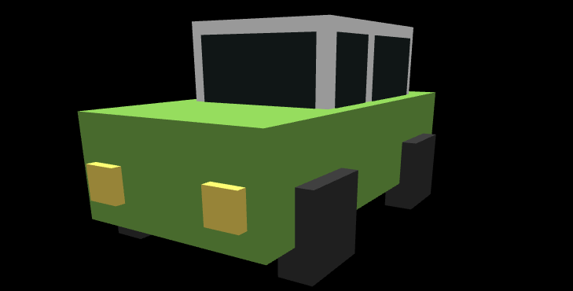

# DRAW A CAR BY THREE JS

> Draw a simple car.

<a href="https://github.com/ngxuancam/car3d"></a>

It is my project about how to draw a car by three js.



## Development setup

Describe how to install all development dependencies and how to run an automated test-suite of some kind. Potentially do this for multiple platforms.

```sh
npm install
npm run dev
```

## Release History

* 0.0.1
  * ADD: CAR

## Contributing

1. Fork it (<https://github.com/ngxuancam/car3d/fork>)
2. Create your feature branch (`git checkout -b feature/fooBar`)
3. Commit your changes (`git commit -am 'Add some fooBar'`)
4. Push to the branch (`git push origin feature/fooBar`)
5. Create a new Pull Request
